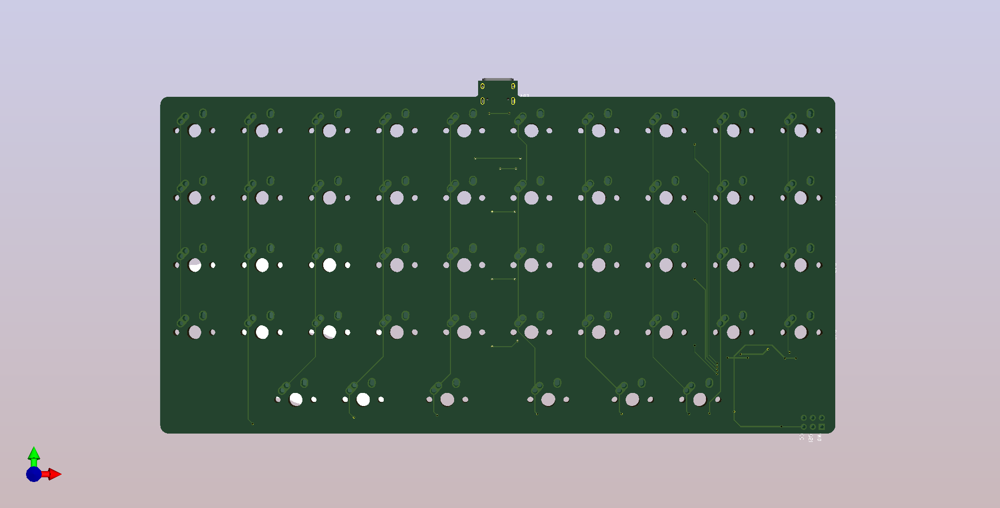
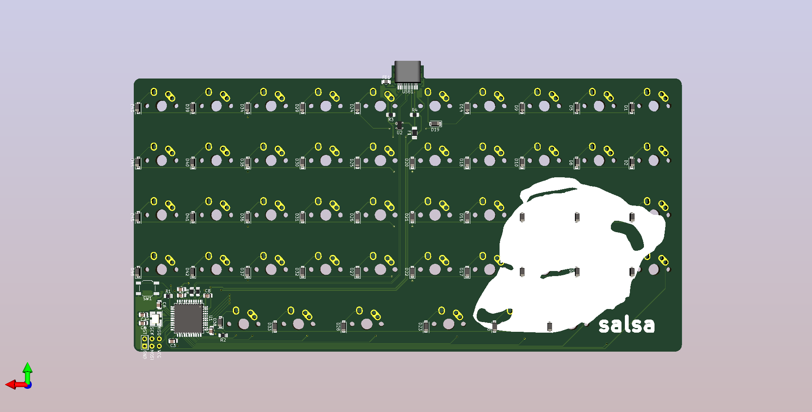

# Salsa
Creating a keyboard (Inspired by Littlefoot) 

Images of Type-C pcb:
 

 

 
Guides used:
 
https://wiki.ai03.com/books/pcb-design/page/pcb-guide-part-1---preparations
 
https://www.masterzen.fr/2020/05/03/designing-a-keyboard-part-1/
